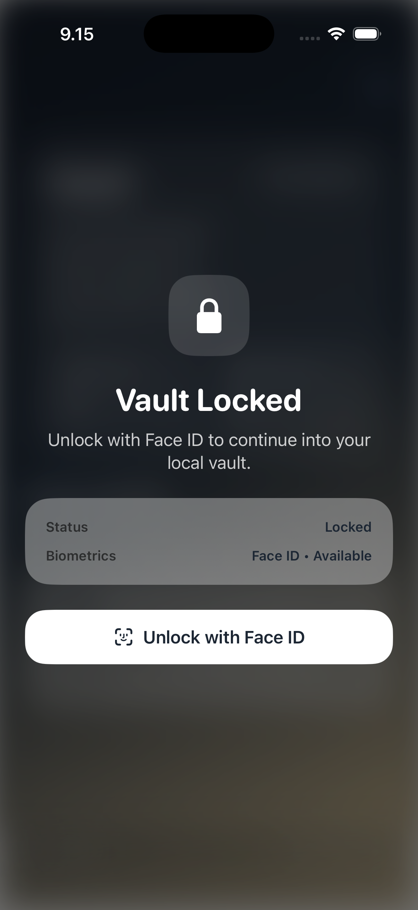
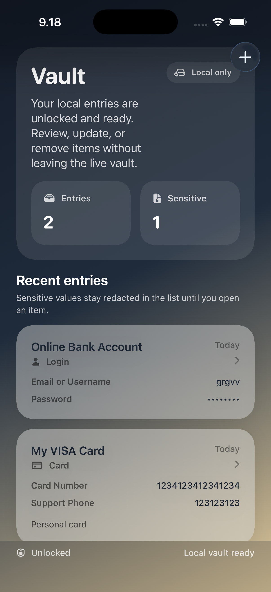
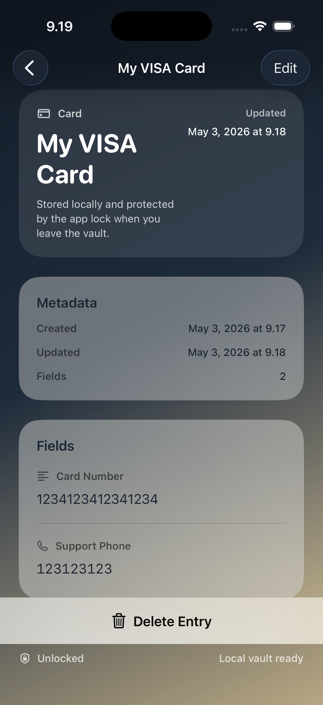
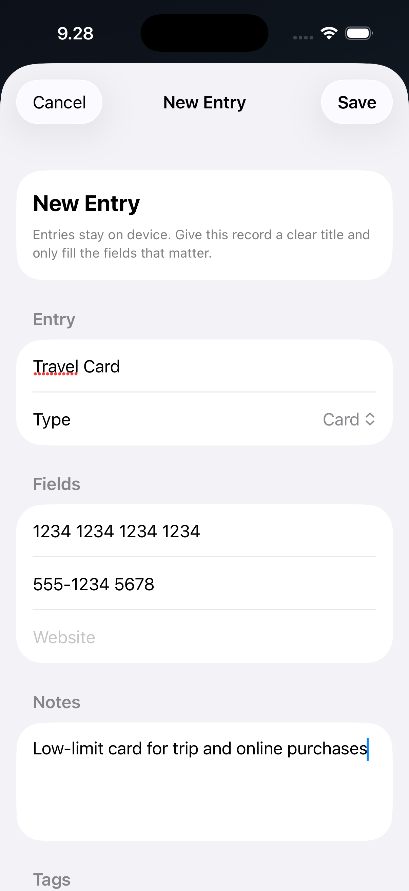

# LockBox

LockBox is a privacy-first iOS vault built with SwiftUI. It stores entry metadata locally, keeps sensitive values in the Keychain, and uses Face ID or Touch ID to lock and unlock access to the vault.


## Highlights

- Biometric lock screen with automatic relock when the app backgrounds
- Local-first vault with no network layer or third-party dependencies
- Create, edit, inspect, and delete entries from a polished SwiftUI flow
- Sensitive values stay redacted in the list view and live in secure storage
- Accessibility and haptic feedback support across the main interactions

## Screenshots

| Lock Screen | Vault List |
| --- | --- |
|  |  |

| Entry Detail | Entry Editor |
| --- | --- |
|  |  |

## Built With

- SwiftUI app lifecycle
- `@Observable` state ownership
- `LocalAuthentication` for biometrics
- Keychain (`Security`) for protected values
- File-backed JSON persistence for entry metadata

## Project Structure

```text
LockBox/
  LockBox/
    App/
    Core/
      Feedback/
      Security/
    Data/
      Models/
      Repositories/
      Storage/
    Domain/
      Entities/
      Repositories/
    Features/
      EntryDetail/
      EntryEditor/
      Lock/
      VaultList/
```

## Core Flows

### Unlock

The app launches into a biometric lock screen. After a successful unlock, the user enters the live local vault. Returning the app from the background relocks the vault automatically.

### Vault

The unlocked vault shows a local-only list of entries with summary counts, redacted sensitive fields, and detail navigation. Entry creation and editing share the same editor flow, while deletion is confirmed from the detail view.

### Storage

LockBox separates metadata from sensitive values:

- entry metadata is stored in a local JSON file
- field payloads are stored in the Keychain
- repository code reconstructs full domain entries from those two layers

## Run

Open `LockBox/LockBox.xcodeproj` in Xcode and run the `LockBox` scheme on an iPhone simulator or a physical device.

Terminal build:

```bash
xcodebuild -project LockBox/LockBox.xcodeproj -scheme LockBox -destination 'generic/platform=iOS Simulator' build
```

## Test

Manual checks:

1. Launch the app and confirm the lock screen appears first.
2. Use Face ID or Touch ID in the simulator `Features` menu to unlock.
3. Create a new entry and verify it appears in the vault list.
4. Open the entry, edit it, save, and confirm the changes persist.
5. Delete an entry and confirm the list refreshes correctly.
6. Send the app to the background, reopen it, and confirm the vault is locked again.

## Notes

- Bundle identifier: `com.pekomon.LockBox`
- Face ID usage description is configured for real-device unlock
- The app starts with an empty vault; it does not seed demo entries into user storage
