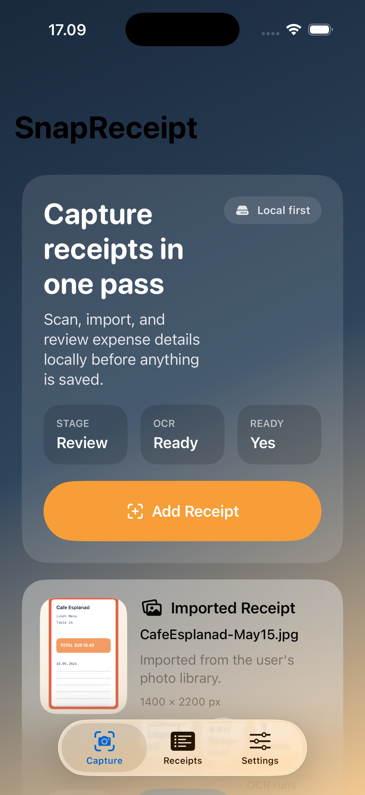
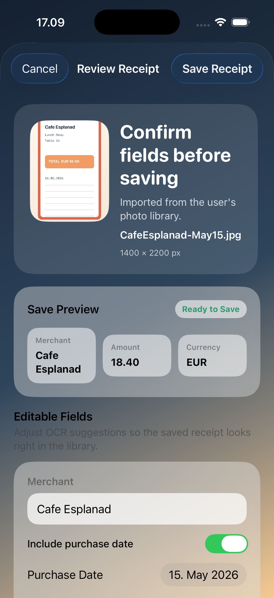
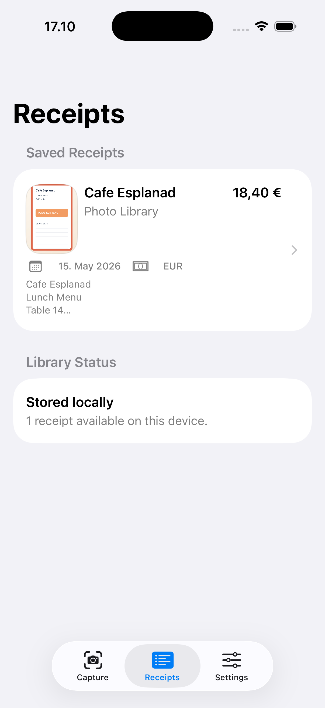
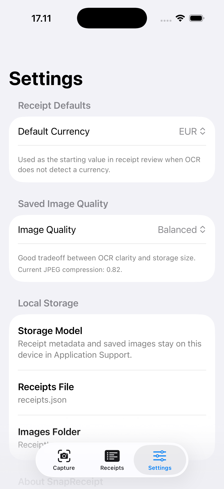

# SnapReceipt

SnapReceipt is a local-first SwiftUI receipt scanner. It imports a receipt image, runs on-device OCR, lets the user review extracted fields, and saves the final receipt plus image into local app storage.


## Highlights

- Camera, photo library, and Files import paths for receipt capture
- On-device OCR with editable review before anything is saved
- Local JSON persistence for receipt metadata plus stored receipt images
- Receipts list, detail view, delete flow, and practical settings
- Accessibility pass, custom app icons, and seeded screenshot/demo support

## Screenshots

| Capture | Review |
| --- | --- |
|  |  |

| Receipts | Settings |
| --- | --- |
|  |  |

## Built With

- SwiftUI app lifecycle
- `@Observable` state ownership
- Vision OCR
- PhotosUI and `fileImporter`
- File-backed JSON persistence
- Local image storage in Application Support

## Project Structure

```text
SnapReceipt/
  SnapReceipt/
    App/
    Core/
      Services/
    Data/
      Repositories/
      Storage/
    Domain/
      Entities/
      Repositories/
    Features/
      Capture/
      ReceiptsList/
      Review/
      Settings/
  Docs/
    AppIconSources/
    Screenshots/
```

## Core Flow

### Capture

The app starts on the Capture tab. Users can scan with the camera, import from Photos, or import from Files. OCR runs after an image is loaded, and the screen shows parsing progress plus a structured summary of the imported asset and recognized content.

### Review

OCR output is converted into a review draft with merchant name, purchase date, amount, and currency suggestions. The user can edit any field before saving. Settings provide a default currency fallback and configurable saved-image compression quality.

### Receipts

Saved receipts appear in a local history list with thumbnail previews, totals, dates, and source metadata. Each receipt opens into a detail screen, and deleting a receipt removes both the metadata record and the stored image file.

## Demo Launch Support

`SnapReceipt` includes a deterministic demo-launch path used for screenshots and manual QA. Set `SNAPRECEIPT_DEMO_SCENARIO` in the run environment to seed local data and open a focused app state.

Supported values:

- `capture`
- `review`
- `receipts`
- `settings`

The seeded demo content includes a synthetic receipt image plus a saved receipt entry for consistent presentation.

## Run

Open `SnapReceipt/SnapReceipt.xcodeproj` in Xcode and run the `SnapReceipt` scheme on an iPhone simulator or a physical device.

Terminal build:

```bash
xcodebuild -project SnapReceipt/SnapReceipt.xcodeproj -scheme SnapReceipt -destination 'generic/platform=iOS Simulator' build
```

## QA Notes

Manual checks that matter most:

1. Import a receipt image from Photos or Files and confirm OCR runs.
2. Edit the parsed review fields and save the receipt.
3. Open the saved receipt from the Receipts tab and confirm detail data and image preview render.
4. Delete a saved receipt and confirm the row disappears immediately.
5. Change default currency and image quality in Settings, then save another receipt and confirm the new defaults apply.

## Notes

- Bundle identifier: `com.pekomon.snapreceipt`
- Receipt data and saved images stay in local Application Support storage
- The app currently uses heuristic parsing for merchant, date, total, and currency extraction
