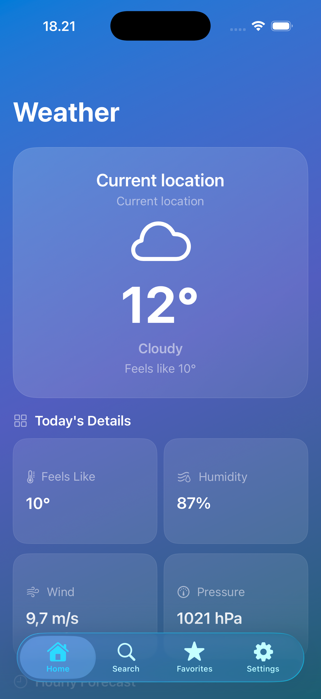
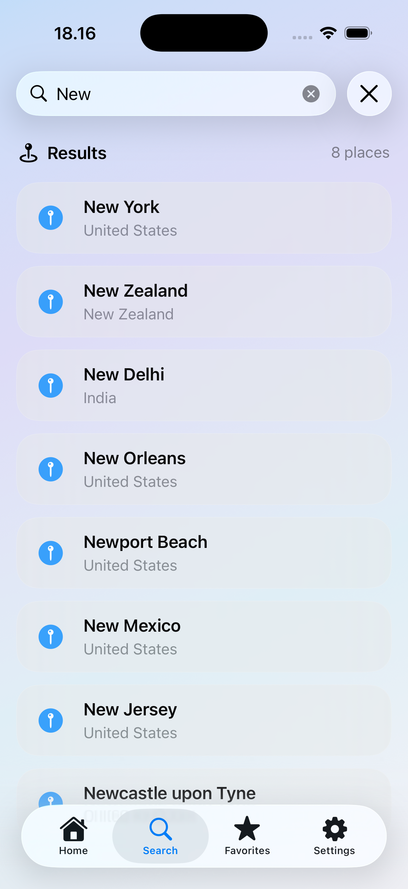
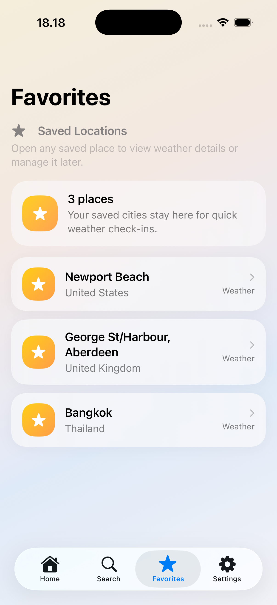
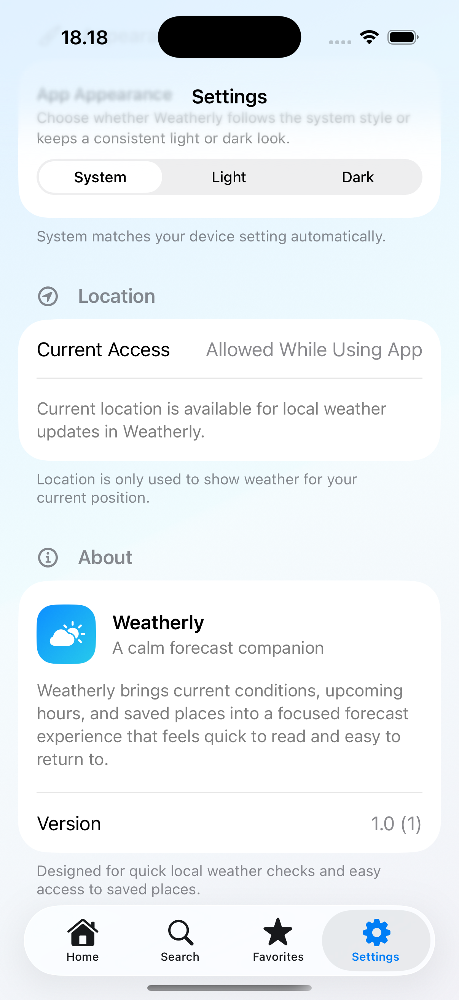
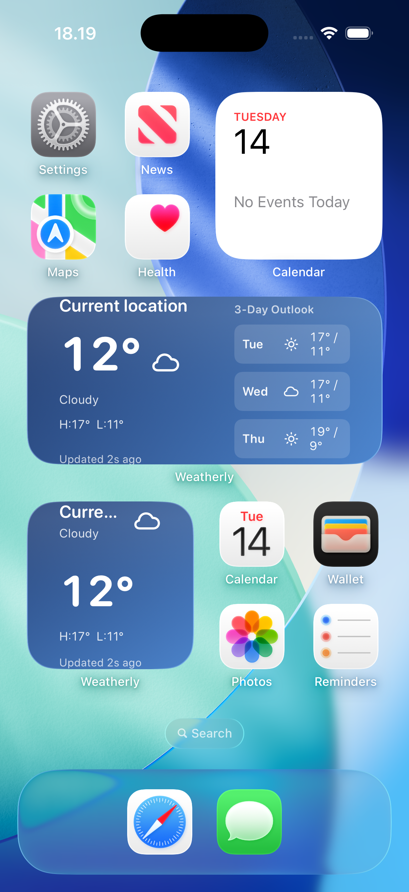
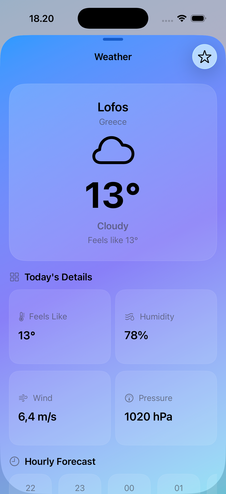
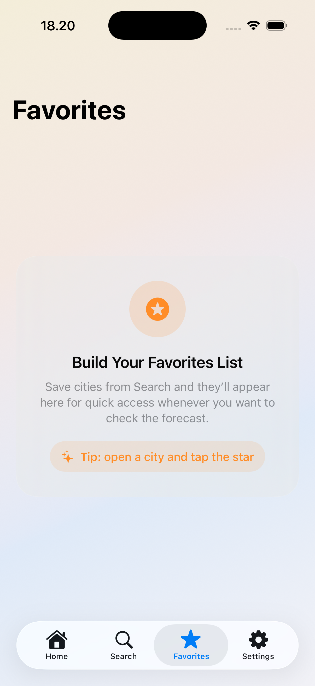
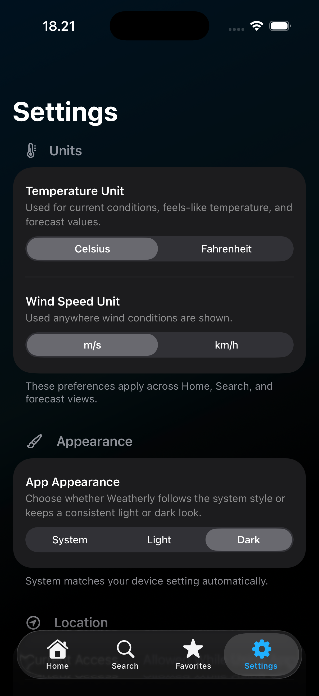

# Weatherly

Weatherly is a SwiftUI weather app focused on fast local forecasts, city search, favorites, and a clean day-to-day experience.

It is built as a showcase-quality iOS project with a feature-first structure, modern Apple frameworks, and practical product polish.

## What The App Does

- Shows current weather and short-term forecast for your current location
- Lets you search cities and open detailed weather for each result
- Supports saving and managing favorite locations
- Includes app-level settings for units and appearance
- Provides a home screen widget for quick weather glance

## Key Features

- Home: current conditions, hourly forecast, daily forecast, weather metrics
- Search: location lookup with recent searches and city detail sheet
- Favorites: saved locations list with quick open and remove actions
- Settings: temperature/wind units, appearance preference, location permission status
- Widget: Weatherly widget powered by shared snapshot data

## Tech Stack

- Swift
- SwiftUI
- Observation (`@Observable`)
- WeatherKit
- CoreLocation
- MapKit (search/autocomplete)
- WidgetKit
- UserDefaults (lightweight persistence for settings/favorites/recent searches)

## Architecture

Feature-first app code with clear module boundaries:

- `App/`: app entry and root navigation
- `Features/`: Home, Search, Favorites, Settings
- `Domain/`: entities and repository protocols
- `Data/`: repository implementations, mappers, service integrations
- `Core/`: shared UI, formatting, location, widget helpers
- `Shared/`: widget snapshot models/stores shared between app and widget target

This keeps UI logic close to each feature while preserving clean boundaries for data and domain concerns.

## Notable iOS Integrations

- WeatherKit-backed weather fetching
- WidgetKit extension for glanceable weather
- CoreLocation permission flow for local weather
- MapKit-powered city search
- URL deep link support (`weatherly://home`)

## Screenshots

Captured on iPhone 17 Pro Simulator and stored under `Weatherly/docs/screenshots/`.

### Core Showcase Set

- Home screen  
  
- Search screen  
  
- Favorites screen  
  
- Settings screen  
  
- Widgets  
  

### Optional Extra Screens

- Search detail view  
  
- Favorites empty state  
  
- Settings dark appearance  
  

### Screenshot Checklist

- Use a single device frame and orientation across app screens
- Capture realistic weather and location data
- Prefer clean states: loaded content, not transient loading/error views
- Keep status bar and theme choices consistent between shots
- Crop and export at web-friendly size for GitHub readability

## Technical Highlights

- Feature polish pass with accessibility improvements on key screens
- Restrained haptic feedback on high-value interactions
- Native launch screen and app icon asset pipeline prepared for final artwork
- Maintainable app/widget data handoff through shared snapshot models
